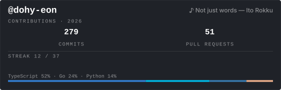

# devstats

[한국어 README](./README.md)

> **Redefine your GitHub profile with minimalist, xAI-inspired SVG cards.**  
> `devstats` is an open-source tool that renders real-time GitHub activity and stats as SVG images via Vercel Serverless Functions.

## Preview



## Quick start

Copy the Markdown below into your profile **`README.md`**.  
Replace **`YOUR_USERNAME`** with your GitHub login.

### 1. Overall stats

Commits, PRs, issues, stars, and more on one card.

```md
[](https://github.com/dohy-eon/devstats)
```

### 2. Top languages

Show which languages you use most across your repositories.

```md
[](https://github.com/dohy-eon/devstats)
```

### 3. Commit streak

Current streak and longest streak at a glance.

```md
[](https://github.com/dohy-eon/devstats)
```

## API endpoints

Use your deployment URL as the base and pass `username` as a query parameter.

- `GET /api/card?username=YOUR_USERNAME`: Overall activity card (commits, PRs, issues, stars, streak summary)
- `GET /api/langs?username=YOUR_USERNAME`: Top languages card based on repository usage
- `GET /api/streak?username=YOUR_USERNAME`: Streak-focused card (current and longest streak)

## Query parameters

Append options with `&` after the URL.

| Parameter | Description | Example |
| :--- | :--- | :--- |
| `theme` | `xai`, `nord`, `dracula`, `dark`, `default` | `&theme=nord` |
| `track` / `song` | Spotify track URL, URI, or ID (profile music block) | `&track=…` |
| `bg_color` | Background hex (no `#`) | `&bg_color=1f2228` |
| `text_color`, `title_color`, `border_color`, `icon_color`, `muted_color` | Text, border, and accent colors | `&text_color=ffffff` |
| `year` | Calendar year for activity stats (overall card) | `&year=2024` |
| `width` / `height` | Card size in px (overall card only; clamped server-side) | `&width=800` |
| `current` / `longest` | Override streak numbers (overall & streak cards) | `&current=5&longest=30` |
| `v` | Bust GitHub’s README image cache | `&v=2` |

Production base URL: `https://devstats-taupe.vercel.app`

## Self-hosting (Vercel)

1. Fork this repository.
2. Import the fork into Vercel.
3. Add required environment variables in your Vercel project (for GitHub API, and optional Spotify integration).
4. Deploy and replace the base URL in your profile `README.md` snippets.

Once deployed, your cards are available as SVG endpoints and can be embedded in GitHub, Notion, or any markdown-compatible surface.

## Highlights

- **Minimal layout**: Dark-first design aligned with an xAI-style aesthetic (default theme: `xai`).
- **Fast for README embeds**: Cache headers (`s-maxage`, `stale-while-revalidate`) suited to CDN and GitHub image caching.
- **Spotify**: Optional `track=` / `song=` for a profile-music row (may require Spotify credentials on the deployment).
- **SVG**: Crisp at any scale in browsers and on GitHub.

## Why use devstats?

- **Profile-ready by default**: Endpoints are designed to be copy-pasted directly into GitHub profile README markdown.
- **Design-first output**: Clean typography and spacing tuned for dark profile themes.
- **Flexible customization**: Theme presets plus manual color controls for brand-consistent cards.
- **Deployment-friendly**: Works well on Vercel with serverless rendering and CDN-aware cache directives.

## Tech stack

- **Runtime**: Vercel Serverless Functions (Node.js)
- **Language**: TypeScript
- **Data**: GitHub GraphQL API v4

---

**Powered by [devstats](https://github.com/dohy-eon/devstats)**
